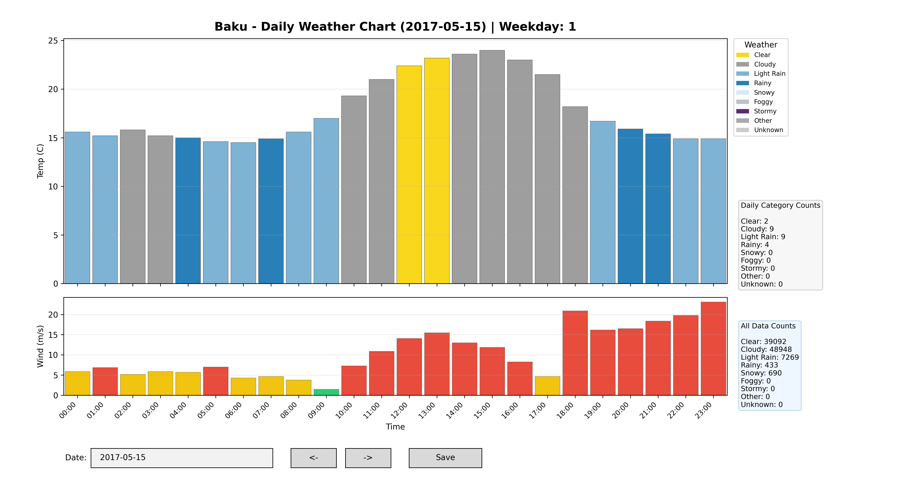
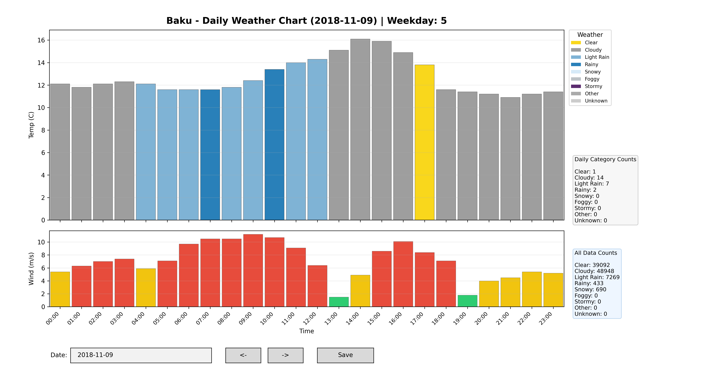

# Baku Yearly Weather Graph

Standalone weather-data project for Baku, Azerbaijan. It includes a weather dataset, a data-generation script that can fetch archive weather data from Open-Meteo, and an interactive daily weather graph.

## Project Structure

```text
baku_hourly_weather_2015_2025/
|-- .gitattributes
|-- .gitignore
|-- README.md
|-- requirements.txt
|-- data/
|   `-- baku_weather_hourly_data.csv
|-- figures/
|   |-- baku_autumn_variable_2018-11-09.png
|   |-- baku_spring_variable_2017-05-15.png
|   |-- baku_summer_variable_2024-07-02.png
|   |-- baku_weather_2025-01-13.png
|   `-- baku_winter_variable_2021-12-25.png
`-- src/
    |-- generate_weather_data.py
    `-- visualize_weather_graph.py

```

Saved figures are written to `figures/`.

## Generated Figures


Four colorful daily examples with frequent weather and wind changes:

| Winter - Mixed | Spring - Mixed |
| --- | --- |
|  |  |
| Summer - Mixed | Autumn - Mixed |
|  |  |


## Dataset

Included dataset: `data/baku_weather_hourly_data.csv`

Columns:

* `time_bin`: timestamp for the weather record
* `temperature`: temperature in Celsius
* `weather_code`: Open-Meteo WMO weather code
* `wind_speed`: wind speed in m/s

The dataset is generated for the `2015-01-01` to `2025-12-31` period, with one record per hour across each full day. The generator script defaults to this same range; adjust `START_DATE` and `END_DATE` in `src/generate_weather_data.py` if you need a different period.

CSV format:

| time_bin | temperature | weather_code | wind_speed |
| --- | --- | --- | --- |
| 2015-01-01 00:00:00 | 5.4 | 3 | 27.2 |
| 2015-01-01 01:00:00 | 5.3 | 3 | 25.8 |
| 2015-01-01 02:00:00 | 5.1 | 3 | 27.1 |
| 2015-01-01 03:00:00 | 5.0 | 3 | 26.5 |
| 2015-01-01 04:00:00 | 4.9 | 3 | 25.8 |

Weather code categories used in the visualization:

| Category | WMO weather codes | Color |
| --- | --- | --- |
| Clear | 0 | `#f9d71c` |
| Cloudy | 1, 2, 3 | `#9e9e9e` |
| Foggy | 45, 48 | `#bdc3c7` |
| Light Rain | 51, 53, 55, 56, 57 | `#7fb3d5` |
| Rainy | 61, 63, 65, 66, 67, 80, 81, 82 | `#2980b9` |
| Snowy | 71, 73, 75, 77, 85, 86 | `#d6eaf8` |
| Stormy | 95, 96, 99 | `#5b2c6f` |
| Other | Any other valid code | `#aaaaaa` |
| Unknown | Empty or invalid weather code | `#cccccc` |


The graph opens an interactive Matplotlib window with:

* temperature chart
* wind speed chart
* weather category labels
* daily and full-dataset category counts
* previous/next date buttons
* date input
* save button

## Setup

```bash
pip install -r requirements.txt

```

## Generate Weather Data

```bash
python src/generate_weather_data.py

```

This writes a fresh CSV to:

```text
data/baku_weather_hourly_data.csv

```

## Visualize Weather Data

```bash
python src/visualize_weather_graph.py

```


## Data Source

Weather data is fetched from the Open-Meteo Archive API using Baku coordinates.
